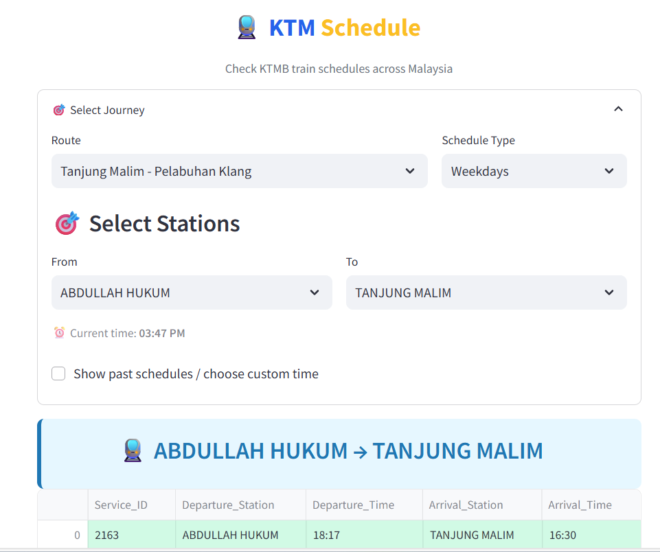

```markdown
# KTMB Train Schedule

Plan your journey with up-to-date KTM Komuter and Intercity train schedules — automatically fetched and structured for easy use.



## Overview

This repository contains automated scripts that scrape and parse the official [KTMB Train Timetable page](https://www.ktmb.com.my/TrainTime.html) daily at 2:00 AM local time. The extracted data is saved as **12 clean Parquet files**, ready for consumption by data applications — including our public [Streamlit web app](https://komuter.streamlit.app/).

### Parquet Files

The following timetable datafiles are generated daily:

1. `klang_weekends_route_2.parquet`  
2. `klang_weekdays_route_1.parquet`  
3. `utara_ipoh_1.parquet`  
4. `batu_caves_weekdays_route_2.parquet`  
5. `utara_ipoh_2.parquet`  
6. `batu_caves_weekdays_route_1.parquet`  
7. `utara_padangbesar_2.parquet`  
8. `klang_weekends_route_1.parquet`  
9. `klang_weekdays_route_2.parquet`  
10. `batu_caves_weekends_route_1.parquet`  
11. `batu_caves_weekends_route_2.parquet`  
12. `utara_padangbesar_1.parquet`

Each file corresponds to a specific route and service day (weekdays vs. weekends/holidays), based on KTMB’s published timetables.

## Web App

Explore and search timetables interactively:  
👉 [https://komuter.streamlit.app/](https://komuter.streamlit.app/)

## Data Source

- Official KTMB Timetable Page: [https://www.ktmb.com.my/TrainTime.html](https://www.ktmb.com.my/TrainTime.html)
- Data is scraped daily and reformatted for programmatic use.

## License

This project is open source under the **MIT License**.

> ⚠️ **Disclaimer**: This project is **not affiliated with Keretapi Tanah Melayu Berhad (KTMB)**. All data is sourced publicly from the official KTMB website for informational purposes only.  
>  
> **Timetables are subject to change by KTMB without notice. Always verify your schedule on the [official KTMB website](https://www.ktmb.com.my) before travel.**
```